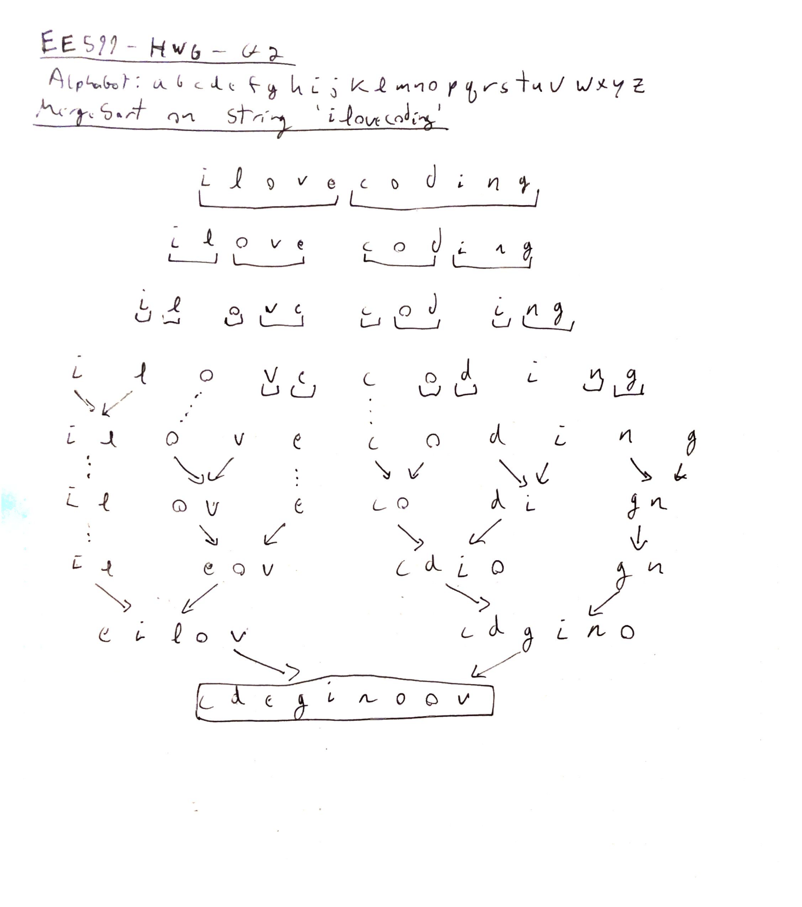

# EE599 HW6 - Graphs and Various Sorting Algorithms

Created - Spencer McDonough : 02/27/2020 
Last Modified - Spencer McDonough : 02/27/2020 
University of Southern California

## Q1 - Graph-Related Facts
1. A tree is a **directed** graph.
2. A tree is a **connected** graph.
3. A tree is an **acyclic** graph.
4. In a tree, there **is not** a path from each vertex to all other vertices.
5. A simple graph is a graph that **contains no self-loops**.

## Q2 - MergeSort Visualization

